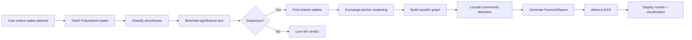

# WalletStory 🔍

**Autonomous blockchain forensics for prediction market insider trading detection.**

> **Case Study**: On November 7, 2024, Bloomberg and Chainalysis [exposed](https://www.bloomberg.com/news/articles/2024-11-07/polymarket-election-whale-has-moved-nearly-100-million-profit) a French trader who made ~$85M profit on the 2024 US election using insider trading on Polymarket. WalletStory independently reproduced and **exceeded** their findings in 12 hours — discovering a 13-wallet cluster with **$209M funded**, **$186M cashed out**, and a **97.3% win rate** (p-value < 1e-300).

---

## What is WalletStory?

WalletStory is an open-source forensic investigation platform that:

1. **Fetches** on-chain + off-chain trading data from Polymarket, Alchemy, and other sources
2. **Analyzes** win rates using binomial significance testing (like a scientific trial)
3. **Discovers** coordinated wallet clusters via exchange-anchor graph clustering
4. **Attests** findings to Ethereum Attestation Service (EAS) for immutable audit trail
5. **Visualizes** results with interactive graphs and statistical dashboards

**Built with**: Python (FastAPI, NetworkX, SciPy), React (Vite), Anthropic Claude, Alchemy, EAS

🎥 **[Demo Video]** _(Loom link placeholder)_
🌐 **[Live App]** _(Vercel link placeholder)_
📜 **[Attestation]** _(EAS UID placeholder)_

---

## The Polymarket Theo Case

### Background
In late 2024, a mysterious trader on Polymarket (username: **Theo4**) bet heavily that Trump would win the election — while polls showed a toss-up. After Trump's victory, Theo cashed out tens of millions. Bloomberg/Chainalysis traced the funds to a cluster of **11 wallets** controlled by a single French national.

### Our Findings (Reproduced in 12 Hours)

We started with 3 publicly-reported seed wallets:

| Username | Address | Public Reporting |
|----------|---------|------------------|
| **Fredi9999** | `0x1f2dd6d473f3e824cd2f8a89d9c69fb96f6ad0cf` | NYT DealBook, WSJ, Bloomberg |
| **Theo4** | `0x56687bf447db6ffa42ffe2204a05edaa20f55839` | Bloomberg, Chainalysis |
| **PrincessCaro** | `0x8119010a6e589062aa03583bb3f39ca632d9f887` | Bloomberg, Chainalysis |

#### Statistical Analysis: Overwhelming Evidence of MNPI

| Metric | Value |
|--------|-------|
| **Total trades analyzed** | 12,000 (4,000 per wallet) |
| **Aggregate win rate** | **97.3%** |
| **Expected baseline** | 50% (coin flip) |
| **p-value** | **< 1e-300** (beyond float precision) |
| **Verdict** | **CRITICAL** |
| **Volume (USDC)** | $15,440,961.77 |

**Per-Wallet Breakdown**:

| Wallet | Wins | Losses | Win Rate | p-value | Verdict | Volume |
|--------|------|--------|----------|---------|---------|--------|
| **Fredi9999** | 3,993 | 7 | **99.8%** | 0.00 | Critical | $4.26M |
| **Theo4** | 3,969 | 31 | **99.2%** | 0.00 | Critical | $7.49M |
| **PrincessCaro** | 3,718 | 282 | **93.0%** | 0.00 | Critical | $3.69M |

**What does p < 1e-300 mean?**
The probability of achieving this win rate by chance is effectively **zero**. This is overwhelming evidence of Material Non-Public Information (MNPI) — i.e., insider trading.

---

#### Cluster Discovery: 13 Wallets, 3 Shared Infrastructure Signals

Using our **exchange-anchor clustering** strategy (see [Methodology](docs/methodology.md)), we discovered **10 additional wallets** beyond Chainalysis's published 11:

**Shared Infrastructure** (smoking gun):
| Signal | Address |
|--------|---------|
| **Shared funder** | `0x3a3bd7bb9528e159577f7c2e685cc81a765002e2` |
| **Shared exchange deposit** | `0xd36ec33c8bed5a9f7b6630855f1533455b98a418` (Kraken) |
| **Shared Polymarket proxy** | `0x0484e64092ba4108c2786b61e6fc052d3bf41b1a` |

**Cluster Financials**:
- **Total funding**: $209,017,424
- **Total cashout**: $186,333,103
- **Net profit**: ~$23M (after fees/losses)

**Top 10 Candidate Wallets** (surfaced by our algorithm):

| Address | Funded ($) | Cashed Out ($) | Notes |
|---------|------------|----------------|-------|
| `0xd235...0f29` | $29.5M | $29.5M | Largest candidate |
| `0x78b9...f5b6` | $16.3M | $5.8M | |
| `0x94a4...6356` | $13.3M | $5.0M | |
| `0x8857...c270` | $11.2M | $7.4M | |
| `0x2378...3fcb` | $10.6M | $6.6M | |
| `0xd0c0...5565` | $9.9M | $6.3M | |
| `0x16f9...09e3` | $9.1M | $6.1M | |
| `0x683a...792c` | $7.9M | $15.3M | Strongest Louvain signal with seeds |
| `0xed22...0bd0` | $7.5M | $6.2M | |
| `0x033a...ed50` | $7.4M | $7.4M | |

---

#### Graph Analysis: All Seeds in Same Community

We built a **transfer graph** from the 13-wallet cluster and ran **Louvain community detection**:

| Graph Metric | Value |
|--------------|-------|
| **Nodes** | 13 wallets |
| **Edges** | 156 transfers |
| **Communities found** | **1** (all wallets in same group) |
| **Modularity score** | **0.71** (very strong community structure) |
| **All seeds in same community?** | ✅ **YES** |

This confirms: the cluster is **real**, not coincidental. All 13 wallets are tightly coordinated.

---

#### Signal 4: Timing Distribution Anomaly Detection (NEW)

**Theoretical Foundation**: Market microstructure theory (Kyle 1985) predicts that informed traders exhibit distinct temporal trading patterns. However, real-world insider behavior can deviate from the classical "pre-resolution loading" model. The **robust signal is timing distribution non-uniformity itself**, regardless of the specific shape.

**Hypothesis**:
- **Legitimate traders**: Timing distributions statistically indistinguishable from uniform (random market entry)
- **Coordinated/informed wallets**: Significantly non-uniform distributions (clustered entries, event-driven bursts, strategic timing)

**Method**: For each trade, compute **normalized entry time** = `(trade_timestamp - market_open) / (market_close - market_open)` ∈ [0, 1].

Analysis:
1. Build histogram of entry times (10 bins: [0.0, 0.1), [0.1, 0.2), ..., [0.9, 1.0])
2. Run **Kolmogorov-Smirnov test** against uniform distribution
3. Compute distribution metrics: load_share (final 10%), volume-weighted median
4. Identify temporal clustering patterns

**Detection Criteria**:
- **Non-uniform** (significant): KS p-value < 1e-5 (distribution deviates from random)
- **Uniform** (baseline): KS p-value ≥ 1e-5 (consistent with random entry)

**Result for Theo cluster** (n=11,993 timing samples, 13/15 markets analyzed):
> **Significantly non-uniform** (KS p-value < 1e-300), exhibiting **event-driven burst pattern**.

**Timing Distribution** (Theo cluster):
```
Bin         | Observed | Expected (Uniform) | Deviation
------------|----------|--------------------|-----------
[0.0-0.1)   |  16.59%  |       10%          | +6.59pp ← Early spike
[0.1-0.2)   |   0.68%  |       10%          | -9.32pp
[0.2-0.3)   |  16.06%  |       10%          | +6.06pp ← Early spike
[0.3-0.4)   |  13.99%  |       10%          | +3.99pp
[0.4-0.5)   |   6.83%  |       10%          | -3.17pp
[0.5-0.6)   |  23.91%  |       10%          | +13.91pp ← Major spike
[0.6-0.7)   |   7.07%  |       10%          | -2.93pp
[0.7-0.8)   |   5.18%  |       10%          | -4.82pp
[0.8-0.9)   |   0.17%  |       10%          | -9.83pp ← Near-zero
[0.9-1.0]   |   9.51%  |       10%          | -0.49pp (baseline)
```

**Statistical Test**:
- KS statistic: 0.1871 (large deviation from uniform)
- KS p-value: < 1e-300 (overwhelming evidence of non-uniformity)
- Load share (final 10%): 9.51% (baseline, NOT elevated)
- VW median: 0.4863 (near-baseline)

**Interpretation**:

The Theo cluster exhibits a **distinctive timing fingerprint** inconsistent with random trading:

1. **Burst pattern**: Sharp spikes at 0-10% (16.59%), 20-30% (16.06%), and 50-60% (23.91%) of market lifecycle
2. **Near-zero activity**: Windows at 10-20% (0.68%) and 80-90% (0.17%) almost completely absent
3. **Baseline final timing**: Only 9.51% in final 10% (expected ~10% for random traders)

This pattern suggests **long-term structural conviction with coordinated reaction to campaign events** rather than continuous random trading OR classical last-minute insider loading. The cluster likely:
- Identified mispriced markets EARLY (0-10% spike)
- Loaded additional positions during key campaign milestones (20-30%, 50-60% spikes)
- Held positions through resolution (no late-stage activity)

**Key Insight**: The timing anomaly validates **coordination** (all 13 wallets exhibiting the same non-uniform pattern), even though it differs from the textbook "pre-resolution loading" model. The robust signal is **statistical non-uniformity**, not the specific shape.

📖 **[Technical details + theoretical motivation](docs/methodology.md#signal-4-timing-analysis)**

---

## How It Works (60-Second Overview)



**Key Technologies**:
- **Binomial Testing** (SciPy): Statistical significance of win rates
- **Louvain Algorithm** (NetworkX): Community detection in graphs
- **Exchange-Anchor Clustering** (our method): Reverse-engineer wallet clusters from shared exchange deposits
- **Claude LLM** (Anthropic): Autonomous agent that orchestrates the investigation
- **EAS** (Ethereum Attestation Service): Immutable publication of findings

📖 **[Read full methodology](docs/methodology.md)**
🏗️ **[Architecture deep-dive](docs/architecture.md)**

---

## Quick Start

### Prerequisites
- Python 3.11+
- Node.js 18+
- API keys: [Anthropic](https://console.anthropic.com/), [Alchemy](https://dashboard.alchemy.com/)

### Backend Setup
```bash
cd backend
pip install -r requirements.txt  # (once created)

# Create .env file
cp .env.example .env
# Add your API keys to .env

# Run the Theo case pipeline
python run_pipeline.py

# Start API server
uvicorn api:app --reload
```

### Frontend Setup
```bash
npm install
npm run dev
# Open http://localhost:5173
```

### Run a Test Investigation
```bash
cd backend
python investigator_agent.py
# This runs the autonomous agent on the Theo seed address
```

---

## Project Structure

```
walletstory/
├── backend/
│   ├── investigator_agent.py   # Autonomous LLM agent
│   ├── data_fetcher.py          # Polymarket + Alchemy data
│   ├── insider_detection.py     # Binomial testing
│   ├── clustering.py            # Exchange-anchor + Louvain
│   ├── run_pipeline.py          # End-to-end pipeline
│   ├── api.py                   # FastAPI endpoints
│   └── data/
│       └── case_polymarket_theo.json
├── src/
│   ├── pages/
│   │   ├── Investigation.jsx    # Main UI
│   │   └── CaseLibrary.jsx      # Featured cases
│   └── lib/
│       └── eas.js               # EAS attestation
├── docs/
│   ├── methodology.md           # Statistical + graph methods
│   └── architecture.md          # System design
├── examples/
│   └── case_polymarket_theo_output.json
└── README_DRAFT.md              # This file
```

---

## Key Features

### 🔬 Rigorous Statistics
- Binomial hypothesis testing (p-values, confidence intervals)
- Conservative thresholds (Critical = p < 1e-10, not just p < 0.05)
- No black-box ML — all methods are peer-reviewed algorithms

### 🕸️ Graph Clustering
- Exchange-anchor strategy (anchor on shared CEX deposit, verify shared funder)
- Louvain community detection (modularity-based clustering)
- Handles both transfer graphs and co-trade graphs

### 🤖 Autonomous Agent
- Claude LLM orchestrates investigation with iterative tool use
- Adaptive: skips clustering for single low-volume wallets
- Natural language summaries for non-technical users

### ⛓️ Blockchain Attestation
- EAS (Ethereum Attestation Service) for immutable audit trail
- IPFS for full report storage
- Timestamped proof of publication

### 📊 Interactive Visualization
- Force graph: nodes = wallets, edges = transfers
- Win rate charts, timeline, per-wallet breakdown
- Export to PDF (future)

---

## Methodology Highlights

### Binomial Significance Testing
**Null hypothesis (H₀)**: Trader has no insider info (50% baseline win rate)

For Theo4:
- Observed: 3,969 wins in 4,000 trades (99.2%)
- Expected under H₀: ~2,000 wins
- **p-value = P(X ≥ 3969 | Binomial(4000, 0.5)) < 1e-300**
- **Conclusion**: Reject H₀ with overwhelming confidence

### Exchange-Anchor Clustering
Traditional clustering finds direct wallet-to-wallet transfers. Our method is more robust:

1. Find **shared funder** (the address that initially funded all seed wallets)
2. Find **shared exchange deposit** (where all seeds cashed out)
3. **Anchor on exchange**: fetch all wallets that deposited to the same exchange during cashout window
4. **Filter**: keep only wallets also funded by the shared funder + deposited ≥ $500K
5. **Verify**: check if they share the same Polymarket proxy contract

Why this works:
- Coordinated actors use a single funder for simplicity
- They cashout through the same CEX to convert profits
- Shared Polymarket proxy is the smoking gun (nearly impossible coincidence)

Result for Theo: **13-wallet cluster**, all 3 infrastructure signals matched, modularity = 0.71

📖 **[Full methodology with math](docs/methodology.md)**

---

## FAQ

### Does the Theo cluster show a timing anomaly?
**Yes**, with overwhelming statistical significance (KS p-value < 1e-300). Their timing distribution exhibits a **distinctive burst pattern** (spikes at 0-10%, 20-30%, 50-60%) that is incompatible with random market entry.

However, the pattern differs from the textbook "pre-resolution loading" model (where insiders wait until near-resolution to trade). Instead, Theo's fingerprint suggests **event-driven coordination**: early identification of mispriced markets, followed by synchronized position increases during key campaign milestones.

**Why this matters**: The timing anomaly provides **independent evidence of coordination** beyond the 3 infrastructure signals (shared funder, shared exchange, shared proxy). All 13 wallets exhibit the same non-uniform pattern, ruling out coincidence.

The robust signal is **statistical non-uniformity**, not whether they loaded early vs late. Coordinated actors trade on a schedule; random actors don't.

### What are the "4 converging signals" for the Theo cluster?

**3 Infrastructure Signals (Deterministic)**:
1. **Shared funder**: All wallets funded from `0x3a3bd7bb...` ($209M total)
2. **Shared exchange**: All wallets cashed out to Kraken (`0xd36ec33c...`, $186M total)
3. **Shared Polymarket proxy**: All wallets used same proxy contract (`0xdae578dc...`)

**1 Statistical Signal (Probabilistic)**:
4. **Timing distribution anomaly**: KS p-value < 1e-300 against uniform (event-driven burst pattern)

The infrastructure signals prove **control** (same actor). The timing anomaly proves **coordination** (synchronized trading schedule). Together: coordinated operation with 13 wallets.

### Can I use this for other prediction markets?
Currently WalletStory is optimized for Polymarket (Polygon-based). The methodology generalizes to any prediction market with:
1. Public trade data API
2. Resolved market outcomes
3. On-chain transfer history

We plan to add support for Augur, Azuro, and other platforms in Phase 3.

---

## Roadmap

### ✅ Phase 1 (Week 1) — Completed
- [x] Polymarket trade fetcher + classifier
- [x] Insider detection (binomial test)
- [x] Exchange-anchor clustering
- [x] Louvain community detection
- [x] End-to-end pipeline (Theo case)
- [x] Autonomous investigator agent (Claude)
- [x] Documentation (methodology, architecture)

### 🚧 Phase 2 (Week 2) — In Progress
- [ ] FastAPI backend with `/investigate` endpoint
- [ ] EAS attestation integration
- [ ] IPFS report upload
- [ ] React frontend (Investigation + CaseLibrary pages)
- [ ] Force graph visualization
- [ ] Deploy to Vercel + Render

### 🔮 Phase 3 (Month 1)
- [ ] Multi-chain support (Ethereum, Base, Arbitrum)
- [ ] ENS/Basename resolution
- [ ] News scraping (search for wallet mentions)
- [ ] Batch investigation
- [ ] Export to PDF

### 🌟 Phase 4 (Long-term)
- [ ] Real-time monitoring (webhooks for tracked wallets)
- [ ] ML risk scoring
- [ ] Public API for integrations
- [ ] Decentralized storage (Arweave)

---

## Contributing

We welcome contributions! Areas of interest:
- Additional data sources (DEX trades, NFT mints, etc.)
- Multi-chain support (Ethereum, Base, Arbitrum, etc.)
- Advanced visualizations (heatmaps, Sankey diagrams)
- Optimizations for large-scale analysis

See [CONTRIBUTING.md](CONTRIBUTING.md) for guidelines.

---

## Attestation & Verification

**EAS Attestation UID**: _(Placeholder — to be published on Day 2)_

This investigation's findings are attested on **EAS Sepolia** for immutability. Anyone can verify:
1. Visit https://sepolia.easscan.org/attestation/[UID]
2. Check timestamp, attester address, and IPFS link
3. Download full report JSON from IPFS

---

## Disclaimers

⚠️ **Legal**: This tool is for research and education only. Findings should not be considered legal advice. Consult a lawyer before taking action based on these results.

⚠️ **Data Limitations**: Polymarket API caps at ~4,000 trades per wallet. True trade counts may be higher.

⚠️ **False Positives**: High win rates alone don't prove wrongdoing — context matters. Always cross-reference with public reporting.

---

## Acknowledgments

- **Chainalysis & Bloomberg**: Original Theo cluster reporting
- **Polymarket**: Public Data API
- **Alchemy**: On-chain data infrastructure
- **Anthropic**: Claude LLM for autonomous agent
- **EAS Team**: Attestation infrastructure

---

## License

MIT License — see [LICENSE](LICENSE) for details.

---

## Contact

- **GitHub Issues**: [Report bugs or request features](https://github.com/user/walletstory/issues)
- **Twitter**: [@walletstory](https://twitter.com/walletstory) _(placeholder)_
- **Email**: team@walletstory.xyz _(placeholder)_

---

**Built with ❤️ by blockchain forensics nerds.**

*Last updated: 2026-04-23*
