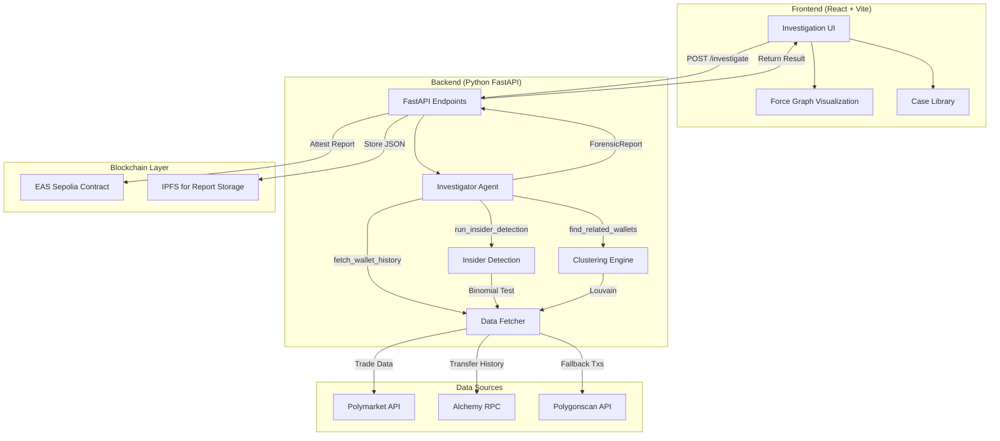

# WalletStory Architecture

This document describes the full-stack architecture of WalletStory, from frontend submission to on-chain attestation.

## System Overview

WalletStory is a forensic investigation platform that:
1. Accepts wallet addresses from users (via web UI)
2. Fetches on-chain + off-chain trading data
3. Runs statistical + graph analysis to detect insider trading
4. Publishes immutable attestations to Ethereum Attestation Service (EAS)
5. Displays interactive visualizations of findings

---

## Pipeline Diagram



---

## Stage-by-Stage Walkthrough

### 1. Frontend: User Input
**Location**: `src/pages/Investigation.jsx`

**Flow**:
- User enters a wallet address (e.g., `0x5668...55839`)
- Frontend validates format (0x + 40 hex chars)
- Sends POST request to `/investigate` endpoint

**Tech Stack**:
- React 19 with React Router
- Recharts for statistical charts
- react-force-graph-2d for cluster visualization

---

### 2. Backend: API Layer
**Location**: `backend/api.py`

**Endpoints**:

#### `POST /investigate`
```json
{
  "address": "0x5668...55839"
}
```

**Response**:
```json
{
  "case_name": "Investigation: 0x5668...",
  "verdict": "Critical",
  "p_value": 0.0,
  "cluster_size": 13,
  "attestation_uid": "0xabc...",
  ...
}
```

#### `GET /case/theo`
Returns precomputed Theo case study results (for Case Library featured case).

**Tech Stack**:
- FastAPI with async/await
- CORS enabled for localhost:5173 (Vite dev server)
- Uvicorn ASGI server

---

### 3. Investigator Agent (Autonomous LLM)
**Location**: `backend/investigator_agent.py`

**Process**:
1. Agent receives seed wallet address
2. Enters reasoning loop with Claude (Anthropic API)
3. Iteratively calls tools:
   - `fetch_wallet_history` → get Polymarket trades
   - `run_insider_detection` → binomial significance test
   - `find_related_wallets` → exchange-anchor clustering
   - `build_cluster_graph` → Louvain community detection
   - `summarize_timeline` → chronological event summary
4. Stops when sufficient evidence gathered (or max iterations)
5. Returns `ForensicReport` JSON

**Why LLM?**:
- Adaptive investigation (skips clustering if only 1 wallet with low volume)
- Natural language summaries for non-technical users
- Future: can incorporate news sources, ENS labels, etc.

---

### 4. Data Fetcher
**Location**: `backend/data_fetcher.py`

**Functions**:

#### `fetch_polymarket_trades(address, max_pages=10)`
- Calls Polymarket Data API: `https://data-api.polymarket.com/trades`
- Paginates with offset (400 trades/page)
- Returns raw trade objects

#### `classify_trades(trades)`
- For each BUY trade, resolve market outcome via Gamma API
- Annotate with `won: true/false`
- Skip SELL trades (not directional)

#### `fetch_counterparties(address, alchemy_key)`
- Uses Alchemy `getAssetTransfers` to get all incoming/outgoing transfers
- Returns list of addresses that interacted with target wallet

**Data Sources**:
- **Polymarket API**: Off-chain trade history
- **Alchemy**: On-chain transfer history (Polygon mainnet)
- **Polygonscan**: Fallback for rate-limited scenarios

---

### 5. Insider Detection
**Location**: `backend/insider_detection.py`

**Function**: `analyze_cluster(wallet_infos, trades_dict, baseline=0.5)`

**Process**:
1. For each wallet:
   - Count wins and losses
   - Compute observed win rate
   - Run binomial test: `binom_test(k, n, p=0.5, alternative='greater')`
2. Aggregate across all wallets:
   - Pool all wins/losses
   - Compute cluster-level p-value
3. Assign verdict:
   - Critical: p < 1e-10
   - High: p < 1e-5
   - Medium: p < 0.01
   - Low: p < 0.05
   - Inconclusive: p ≥ 0.05

**Output**:
```python
{
  "aggregate": {
    "win_rate": 0.973,
    "p_value": 0.0,
    "verdict": "Critical",
    ...
  },
  "per_wallet": [...]
}
```

---

### 6. Clustering Engine
**Location**: `backend/clustering.py`

**Functions**:

#### `discover_cluster_via_exchange(seed_addrs, alchemy_key, min_cashout_usd)`
**Exchange-Anchor Strategy**:
1. Find shared funder address (funded all seeds)
2. Find shared exchange deposit address (all seeds cashed out here)
3. Fetch all wallets that deposited to exchange in cashout window
4. Filter: only wallets funded by same funder + deposited ≥ $500K
5. Verify all share same Polymarket proxy

**Returns**: Cluster metadata + candidate addresses

#### `build_exchange_anchor_graph(cluster_info)`
Constructs a NetworkX graph:
- Nodes: wallet addresses
- Edges: direct transfers between wallets

#### `analyze_theo_cluster(seed_addrs, graph, graph_type)`
1. Run Louvain community detection
2. Check if all seeds land in same community
3. Return modularity score, community size, candidate wallets

**Graph Types**:
- **exchange-anchor**: Transfer graph anchored on shared exchange
- **co-trade**: Edges between wallets that traded same markets within 48hrs

---

### 7. EAS Attestation (Future: Day 2)
**Location**: `src/lib/eas.js` (to be created)

**Flow**:
1. After generating `ForensicReport`, upload JSON to IPFS
2. Create EAS attestation on Sepolia testnet:
   - Schema: `WalletForensicReport`
   - Fields: `address`, `verdict`, `p_value`, `ipfs_hash`
   - Attester: WalletStory deployer address
3. Return attestation UID to frontend

**Why EAS?**:
- Immutable audit trail (can't delete/edit findings)
- Timestamped proof of publication
- Interoperable with other dapps (anyone can verify attestation)

**Contract**: `0x...` (Sepolia EAS contract address)

---

### 8. Frontend Visualization
**Location**: `src/pages/Investigation.jsx`

**Components**:

#### Investigation Results Panel
- Summary card: Verdict, p-value, win rate
- Per-wallet table: breakdown by address
- Cluster info: shared infrastructure details

#### Force Graph
- Nodes: wallets (size = volume)
- Edges: transfers or co-trades
- Color: community assignment (Louvain)
- Interactive: click node to see details

#### Timeline
- Chronological list of key trades
- First/last trade timestamps
- Market names with outcomes

---

## Tech Stack Summary

| Layer | Technology |
|-------|-----------|
| **Frontend** | React 19, Vite, React Router, Recharts, react-force-graph-2d |
| **Backend** | Python 3.11+, FastAPI, Uvicorn |
| **Data APIs** | Polymarket Data API, Alchemy, Polygonscan |
| **LLM** | Anthropic Claude (Sonnet 4) |
| **Statistical** | SciPy (binomial testing) |
| **Graph** | NetworkX (Louvain community detection) |
| **Blockchain** | EAS (Ethereum Attestation Service), IPFS |
| **Deployment** | Vercel (frontend), Render/Railway (backend) |

---

## Data Flow Example: Investigating Theo

```
1. User enters: 0x56687bf447db6ffa42ffe2204a05edaa20f55839

2. Frontend → POST /investigate

3. Backend spawns InvestigatorAgent

4. Agent → fetch_wallet_history
   ↓
   Polymarket API returns 4,000 trades
   ↓
   classify_trades: 3,969 wins, 31 losses

5. Agent → run_insider_detection
   ↓
   binom_test(3969, 4000, 0.5) → p < 1e-300
   ↓
   Verdict: Critical

6. Agent → find_related_wallets
   ↓
   Alchemy fetch all transfers for 0x5668...
   ↓
   Shared funder: 0x3a3b...002e2
   Shared exchange: 0xd36e...2418
   ↓
   discover_cluster_via_exchange
   ↓
   10 candidate wallets found

7. Agent → build_cluster_graph
   ↓
   NetworkX graph: 13 nodes, 156 edges
   ↓
   Louvain: 1 community, modularity 0.71

8. Agent → summarize_timeline
   ↓
   First trade: 2024-09-15
   Last trade: 2024-11-05

9. Agent returns ForensicReport

10. Backend → attest to EAS (future)
    ↓
    Upload JSON to IPFS
    ↓
    Create attestation on Sepolia
    ↓
    UID: 0xabc...

11. Backend → return JSON to frontend

12. Frontend renders:
    - Verdict: Critical
    - p-value: 0.00e+00
    - Cluster: 13 wallets, $209M funded, $186M cashed out
    - Force graph visualization
    - Attestation link
```

---

## Deployment Architecture

### Frontend (Vercel)
```
Repo: github.com/user/walletstory
Framework: Vite
Build: npm run build
Output: dist/
Domain: walletstory.vercel.app
```

### Backend (Render/Railway)
```
Service: Web Service
Language: Python 3.11
Start: uvicorn backend.api:app --host 0.0.0.0 --port 8000
Env: ANTHROPIC_API_KEY, ALCHEMY_API_KEY, etc.
Domain: walletstory-api.onrender.com
```

### Environment Variables
```bash
# Backend .env
ANTHROPIC_API_KEY=sk-ant-...
ALCHEMY_API_KEY=...
POLYGONSCAN_API_KEY=...
EAS_PRIVATE_KEY=... (for attestation signer)

# Frontend .env
VITE_API_URL=https://walletstory-api.onrender.com
```

---

## Security Considerations

1. **Rate Limiting**: Backend implements rate limits on `/investigate` to prevent API abuse
2. **API Key Protection**: Never expose Anthropic/Alchemy keys in frontend
3. **Input Validation**: Sanitize wallet addresses (regex check for 0x[a-fA-F0-9]{40})
4. **CORS**: Restrict to production domain in deployed backend
5. **EAS Attestation**: Use dedicated signer wallet, not user funds

---

## Future Enhancements (Roadmap)

### Phase 2 (Week 2)
- [ ] EAS attestation integration
- [ ] IPFS upload for full report storage
- [ ] Advanced visualizations (heatmaps, timeline charts)
- [ ] Export to PDF report

### Phase 3 (Month 1)
- [ ] Multi-chain support (Ethereum, Base, Arbitrum)
- [ ] ENS/Basename resolution for wallet labels
- [ ] News scraping integration (search for wallet mentions)
- [ ] Batch investigation (analyze multiple wallets at once)

### Phase 4 (Long-term)
- [ ] Real-time monitoring (alert when tracked wallet trades)
- [ ] Machine learning risk scoring
- [ ] Public API for third-party integrations
- [ ] Decentralized storage (Arweave/Filecoin)

---

## References

- [FastAPI Docs](https://fastapi.tiangolo.com/)
- [Anthropic API](https://docs.anthropic.com/)
- [Alchemy SDK](https://docs.alchemy.com/)
- [NetworkX](https://networkx.org/)
- [EAS Documentation](https://docs.attest.sh/)
- [Polymarket API](https://docs.polymarket.com/)
